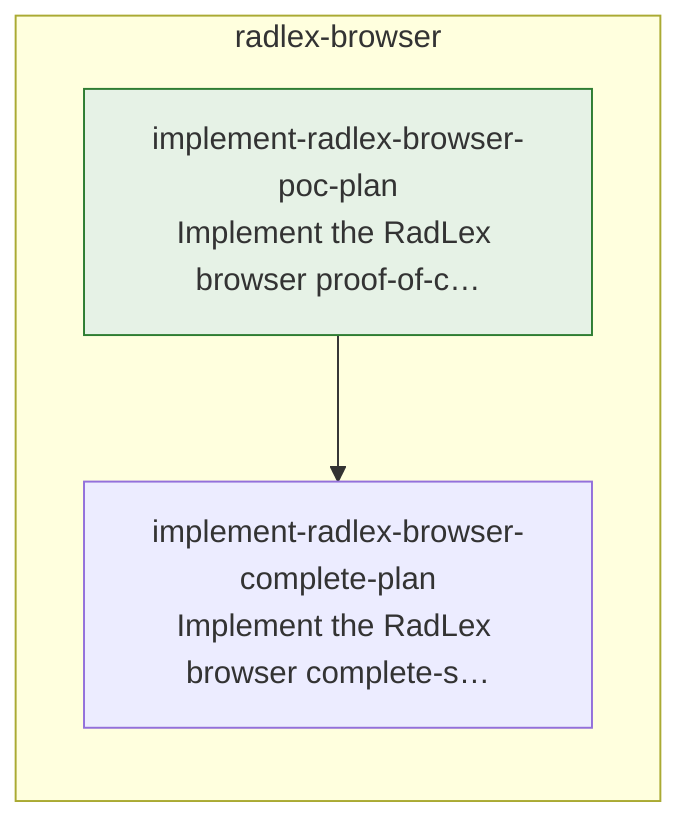

# TODO

<!-- todo:worklist:start -->

## Start here
_as of 2026-10-07 · 1 streams startable · 0 now/next items untyped_

- radlex-browser — next: Implement the RadLex browser proof-of-concept plan (build) → enables 1

## Dependency map

_0 open items carry no edge and are not drawn._

## Now

- **Implement the RadLex browser proof-of-concept plan**
  Build the generator, term pages, tree, search, in-site navigation, gates, Pages workflow, linter pass, and speed check, ending with a public site that browses all of RadLex 4.3.
  ↳ links: ~/GitHub/anatomy-ontology/radlex/docs/plans/2026-10-06-radlex-browser-poc-plan.md

## Next

- **Implement the RadLex browser complete-site plan** — after Implement the RadLex browser proof-of-concept plan
  Add the per-term data files, copy functions, downloads and info pages, service worker, CI speed check, and legacy URL inventory, then draft the move into `RSNA/RadLex`.
  ↳ links: ~/GitHub/anatomy-ontology/radlex/docs/plans/2026-10-06-radlex-browser-complete-plan.md

<!-- todo:worklist:end -->

<!-- todo:continuation:start -->

## Continuation

Resume the proof-of-concept plan, `~/GitHub/anatomy-ontology/radlex/docs/plans/2026-10-06-radlex-browser-poc-plan.md`, at **Measure speed**, with `/implement-plan` on that path. Steps through **Deploy to Pages** are done, and the plan's deviations section records each step's outcome.

- **Measure speed:** shard the search index by letter (Michael's ruling). The plan's step 14 ruling line holds the sizing and the design notes: give RIDs their own path, keep stop words like "of" out of the word-start entries, and mark substring results partial until every shard loads. Edit the series map's "Bundles" contract in the same change. Then run `python3 tests/speed.py` against the live site.
- **Deploy to Pages:** one check is open. Confirm that a scheduled run with no change exits early, with `gh run list --repo hoodcm/radlex-browser --event schedule`.
- **Close the plan:** follow the series map's session protocol, then name `2026-10-06-radlex-browser-complete-plan.md` as next.

The gates are `python3 -m pytest tests -q` (114 passing at hand-off) and `python3 tests/browser_smoke.py --input <owl or tsv folder>` (nine of nine on 4.4 and 4.3).

<!-- todo:continuation:end -->
