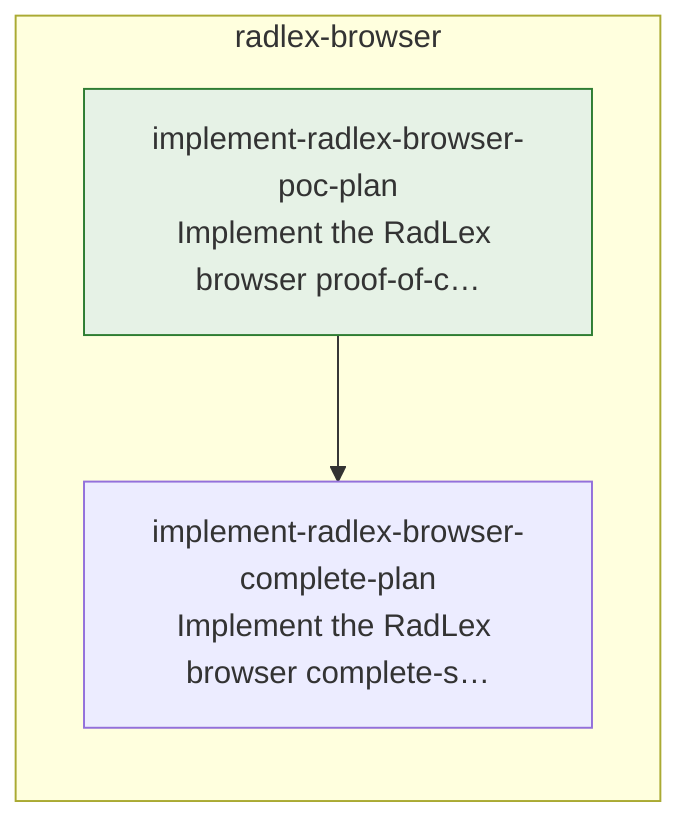

# TODO

<!-- todo:worklist:start -->

## Start here
_as of 2026-10-07 · 1 streams startable · 0 now/next items untyped_

- radlex-browser — next: Implement the RadLex browser proof-of-concept plan (build) → enables 1

## Dependency map

_0 open items carry no edge and are not drawn._

## Now

- **Implement the RadLex browser proof-of-concept plan**
  Build the generator, term pages, tree, search, in-site navigation, gates, Pages workflow, linter pass, and speed check, ending with a public site that browses all of RadLex 4.3.
  ↳ links: ~/GitHub/anatomy-ontology/radlex/docs/plans/2026-10-06-radlex-browser-poc-plan.md

## Next

- **Implement the RadLex browser complete-site plan** — after Implement the RadLex browser proof-of-concept plan
  Add the per-term data files, copy functions, downloads and info pages, service worker, CI speed check, and legacy URL inventory, then draft the move into `RSNA/RadLex`.
  ↳ links: ~/GitHub/anatomy-ontology/radlex/docs/plans/2026-10-06-radlex-browser-complete-plan.md

<!-- todo:worklist:end -->
